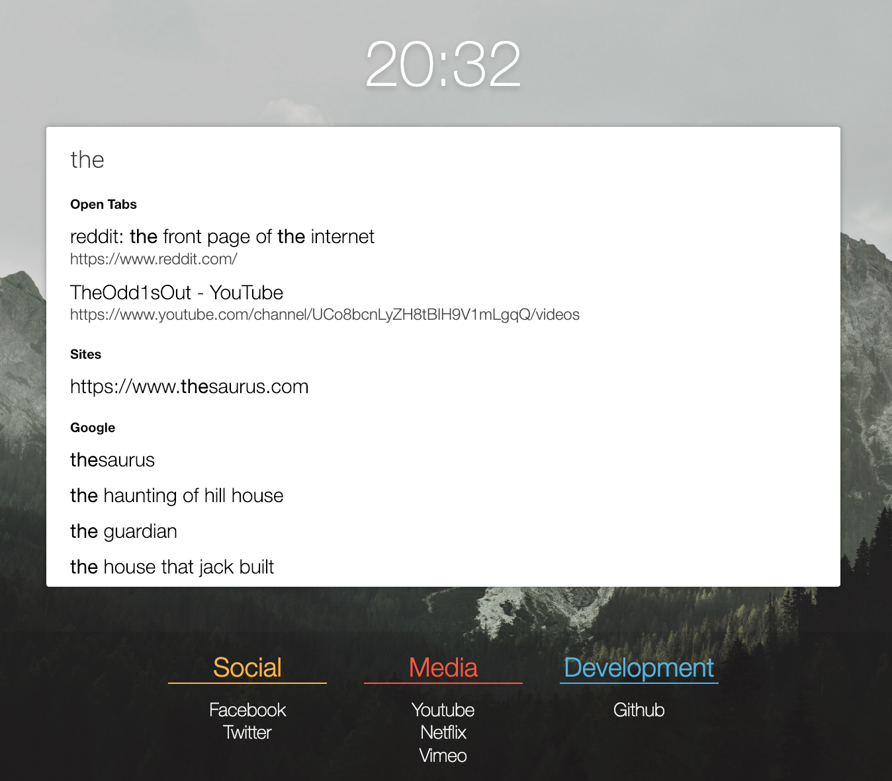

# Better Startpage

> A better startpage for your browser

Better Startpage is a web extension that enhances the default start page of the browser.

## Development

To build the project, clone it and run the following commands

    $ yarn install
    $ yarn start

Or the following, if you're using NPM

    $ npm install
    $ npm run start

A new directory will be created called `dist`, containing the built extension.
In your browser, load it as an unpacked extension, by enabling addon developer mode, and selecting the `dist/manifest.json` file.
